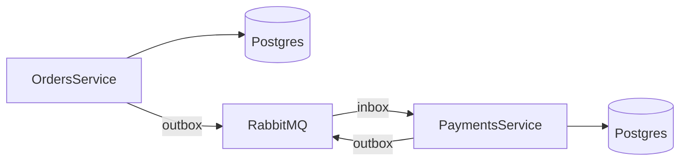

# AsyncShop

Микросервисное приложение интернет-магазина с асинхронной обработкой заказов и платежей через RabbitMQ.

## Сервисы

- **OrdersService** — создаёт заказы, сохраняет события в Outbox.
- **PaymentsService** — потребляет события заказов, списывает средства, публикует статус.
- **RabbitMQ** — брокер сообщений с management UI.
- **SQLite** — используется каждой службой для хранения данных локально (в контейнере).

## Архитектура

- Микросервисная структура.
- Асинхронное взаимодействие через **RabbitMQ**.
- Паттерн **Transactional Outbox + BackgroundConsumer**.
- Взаимодействие между сервисами через обмен сообщениями (event-driven).



## Запуск проекта

### Предварительно

- Убедитесь, что установлен [Docker](https://www.docker.com/).
- Порты `5171`, `5261`, `15672`, `5672` не должны быть заняты.

### Запуск через Docker Compose

```bash
docker-compose up --build
```

После запуска:

- Orders API: http://localhost:5171/swagger
- Payments API: http://localhost:5261/swagger
- RabbitMQ UI: http://localhost:15672 (логин: `bse2327`, пароль: `hse236`)

### Просмотр БД

```bash
docker cp asyncshop-orders-service-1:/app/data/Orders.db ./Orders.db
docker cp asyncshop-payments-service-1:/app/data/payments.db ./payments.db
```

Можно открыть через [DB Browser for SQLite](https://sqlitebrowser.org/).

## Процессинг Outbox

Сервис `OutboxProcessor` (в OrdersService) читает непросмотренные события (`Processed = false`) и публикует их в RabbitMQ.

PaymentsService потребляет их через фоновый `OrderConsumer`, проверяет баланс и возвращает статус заказа (Paid / Failed).

## Готово на текущий момент

- [x] OrdersService: создание заказов + Outbox
- [x] PaymentsService: списание денег + статус заказа
- [x] RabbitMQ: обмен событиями
- [x] Docker Compose для всех сервисов
- [x] Swagger UI для обоих сервисов
- [x] Auto-Migrations (EF Core)
- [x] Локальные тома для хранения баз данных

## Структура репозитория

```
AsyncShop/
├── OrdersService/
│   ├── Controllers/
│   ├── Services/
│   ├── Data/
│   ├── Interfaces/
│   ├── Models/
│   ├── Migrations/
│   └── Dockerfile
├── PaymentsService/
│   ├── Controllers/
│   ├── Services/
│   ├── Data/
│   ├── Models/
│   ├── Migrations/
│   └── Dockerfile
├── docker-compose.yml
└── README.md
```
